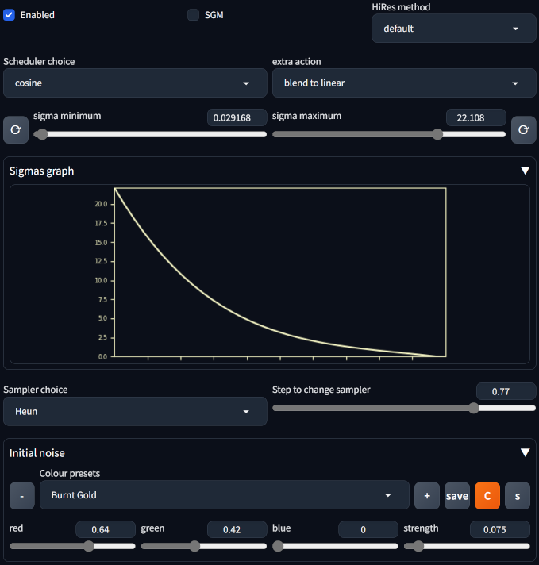

# Scheduler Override #
### extension for Forge webui for Stable Diffusion ###
---
### 17/06/2024 ###
add/delete noise colour presets, and save list (overwrites **colourPresets.py** in the extension directory). The list is no longer selection only, names can be typed in. So after you find a colour you like and want to save, edit the name to something suitably cool then hit the '+' button to add to the list. '-' button removes current option, but doesn't clear the settings, so if you delete accidently you can immediately add it back. Additions and deletions are session only unless saved. No direct overwrites, but you can delete then add. List is always alphabetical order, sorted when new entry added.

included basic gamma for the input colours, to better match expected values. Using square root (= gamma 2.0). No need to be more precise IMO. Preset list updated accordingly.

### 10/06/2024 ###
add "simple" option to scheduler choice, so now "None" actually means no change to whatever is default for selected sampler (avoids patching get_sigmas function if not necessary).

### 09/06/2024 ###
added ways of manipulating the starting noise, mainly colourising it. There are extensions which do this already ([example](https://github.com/kenning/sd-webui-noise-color-picker)) , but they switch to img2img processing behind the scenes, which is excellent cheating. But in this repo, things are done *properly*: by patching the entire sample function which I was already doing anyway. Some samplers reduce/block the effect: DPM++ SDE, UniPC. Effect also dependent on model. Which makes the preset list largely pointless.

As this modifies the initial noise it can have a significant effect on the final result. If doing serious work, you probably want to settle on settings before spending time refining your prompt.

Presets stored in **colourPresets.py** in the extension directory. ~~Currently manual edits only. Need a button to add/delete?~~

**c** button toggles centre to mean of initial noise.

**s** button toggles sharpening of initial noise.

### 26/05/2024 ###
changed method of checking for Euler Dy samplers, previous method didn't always find them (possibly due to extension load order?)

fixed error when using hires alt and hires steps not set

added alternate alt hires method, linear scale, typically needs even lower denoise. experimental.

### 16/05/2024 ###
Align Your Steps now auto selects correct version. Hence, name changed in list and one option removed.

Special case added for 1-step; previously some schedulers and the extra actions could error with just one step.

### 11/05/2024, many updates / reworks ###
Ineffective options removed, new (perhaps also ineffective) options added.

**Custom list** option removed, now lists are interpreted as part of the **Custom** option. Use is same as before.

Sigma minimum and maximum sliders added. Tweaking the minimum up seems to add detail/contrast; adjusting the maximum down can tidy busy backgrounds. Note: some (SDE?) samplers do not like this.

Graph option shows the sigma curve. Curve for "None" can't be drawn as getting those sigmas at this stage is a pain.

...more...

Bump extra action removed, I recommend to use [Detail Daemon](https://github.com/muerrilla/sd-webui-detail-daemon) instead. That extension hits the sigmas in a different place, so is fully compatible and gives much more control.

---
## Install ##
Go to the **Extensions** tab, then **Install from URL**, use the URL for this repository.

--- 

---
## Basic usage ##
*	Select a noise scheduler from the dropdown menu. When the extension is enabled, this scheduler will be used instead of the default scheduler linked to your selected Sampling method.
Settings used are saved with metadata, and restored from loading through the **PNG Info** tab.
*	Select a sampler and a step to switch to it. For example, select DPM++ SDE in the normal sampler selection, then use this to switch to Euler after 60%.
---
## Advanced / Details ##
I patch the **get_sigmas** function in **KDiffusionSampler**, then unpatch ASAP (in my function).
Some extra schedulers have been added:
* ~~*polyexponential* is part of k-diffusers, normally unused.~~ Again unused, seems to return identical sigmas to exponential.
* *cosine* is clear from the name, see also *custom examples*. Combines well, IMO, with extra action *blend to linear*.
* *phi* is a slightly tweaked version of the golden scheduler from [Extraltodeus](https://github.com/Extraltodeus/sigmas_tools_and_the_golden_scheduler).
* *fibonacci* is a reverse fibonacci curve, scaled down by step to keep it under control a little longer. Even so, high step counts will result in a long run of very low sigmas - i.e. minimal change to results. So best with lower steps, probably.
* *continuous VP* is also in k-diffusers, normally unused. ~~From brief testing, seems worthwhile.~~ From testing, seems insane. Starts from very high sigma. Probably intended for a specific sampler.
* ~~*squared* is an ultra-simple curve: step is normalised to 1.0 -> 0.0, squared, then scaled to *sigma_max*-> *sigma_min*. Again, from brief testing, seems good. Equivalent to custom function: m + (M-m)*(1-x)*(1-x)~~
* *4th power* is a simple curve: step is normalised to 1.0 -> 0.0, taken to fourth power, then scaled to *sigma_max*-> *sigma_min*. Again, from brief testing, seems good. Equivalent to custom function: m + (M-m)*(1-x)**4
* ~~*LCM to linear* starts with LCM up to change step, then linear to minimum sigma. Actually testing switching to linear one step earlier, to retain higher sigmas and hopefully add detail with the second sampler. Experimental.~~ Removed: LCM sigmas matched default (None) schedule
* ~~*linear* is not even a curve. It's *squared* without the squaring. Sometimes has use, often does not.~~
* *Align Your Steps* is an optimised schedule from [nVidia](https://research.nvidia.com/labs/toronto-ai/AlignYourSteps/). The schedule given in the paper is log-linear interpolated to the set number of steps.
* *custom* allows user-generated schedules using standard Python code. The custom function is evaluated at each step. The following variables are defined:
	* *m*: minimum sigma (adjustable in **Settings**, usually ~0.03, and in UI)
	* *M*: maximum sigma (adjustable in **Settings**, usually ~14.6, and in UI)
	* *n*: total steps
	* *s*: this step
	* *x*: step / (total steps - 1)
	* *phi*: (1 + sqrt(5)) / 2
	*more may be added later*
	a list entered in the form [n0, n1, n2, ...] will be log-linear interpolated to the required number of steps
* ~~*custom list* log-linear interpolates a user provided list in the form [n0, n1, n2, ...]~~

### custom examples ###
* *cosine*: m + 0.5 * (M - m) * (1 - math.cos(pi * (1-x**0.5)))

### extra action dropdown ###
Take the scheduler choice and do something with the results. The blends are based on progression through the steps, so *blend to linear* becomes linear at the end. In this case, linear means a line from sqrt(sigma_max) to sigma_min. *Threshold* takes the maximum of the sigmas and this same linear line. ~~*Bump* inserts a boost between steps 0.2 and 0.6. May be better moved to a third dropdown option; multiselect for now - order of actions matters.~~

Support for Euler Dy and Euler SMEA Dy samplers requires that the relevant extension be installed.

### alternate scheduling for HiRes ###
There are standard methods for adjusting the scheduler during hires fix:
	1. **(default)** multiply step count by the denoising strength, then use that number of steps from the end of the normally calculated schedule.
	2. **(if the option to always use the specified number of steps is enabled)** divide step count by the denoising strength, generate a new schedule of this length, then use the last step count from this new schedule.

This method takes another, even simpler, approach. Multiply sigma_max by the denoising strength, generate schedule based on that. Denoise factor now operates more predictably, IMO.

---
## to do? ##
1. ~~option to change sampler after some number of steps. There is an extension that does this: [Seniorious by Carzit](https://github.com/Carzit/sd-webui-samplers-scheduler). I think it makes sense to include that functionality here.~~
	Now just needs improving, maybe multiple switches. Though 1 + 2 switches seems like the most that would ever be reasonable.
2. ~~import math for custom schedulers, (probably necessary)~~
3. ~~options to set sigma limits (probably not, easy to do in Settings)~~
4. support for Restart sampler, which calculates Karras sigmas internally so ignores this override.
5. tidying, jank removal
6. ~~better Euler Dy support without hardcoding function names~~
7. ~~loading actions from image metadata. Saves OK, but doesn't restore.~~

---
## Inspiration ##
[Extraltodeus](https://github.com/Extraltodeus/sigmas_tools_and_the_golden_scheduler)

[Carzit](https://github.com/Carzit/sd-webui-samplers-scheduler)

[Muerilla](https://github.com/muerrilla/sd-webui-detail-daemon) for how to graph plot

~~[keturn](https://discuss.huggingface.co/t/decoding-latents-to-rgb-without-upscaling/23204/2) for latent->RGB approximate conversion matrix.~~ No longer used, now I encode colour with VAE. Matrix was a good approximation for sd1.5 but not for sdXL.

---
## License ##
Public domain. Unlicense. Free to a good home.
All terrible code is my own. I've learned from other extensions, StackOverflow, Bing Chat, banging my head against my desk, and cursing IDLE. No warranty. Check the code for yourself.

